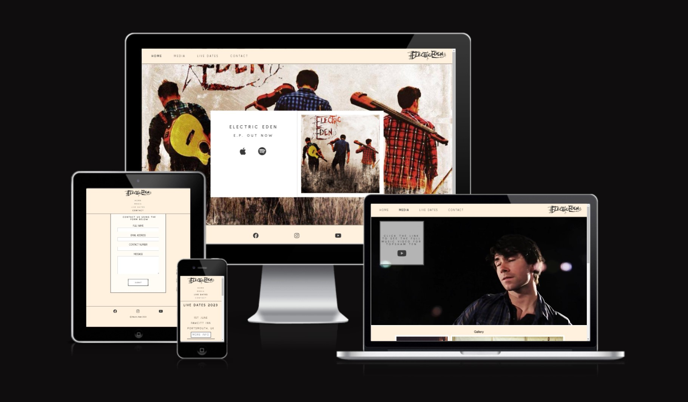
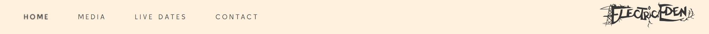
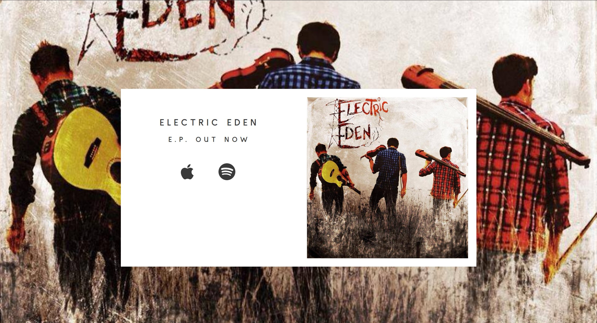
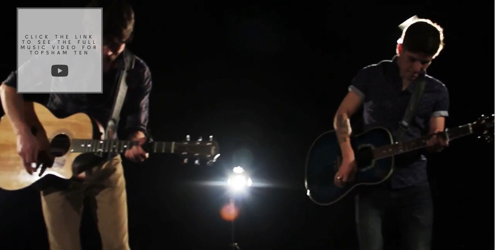
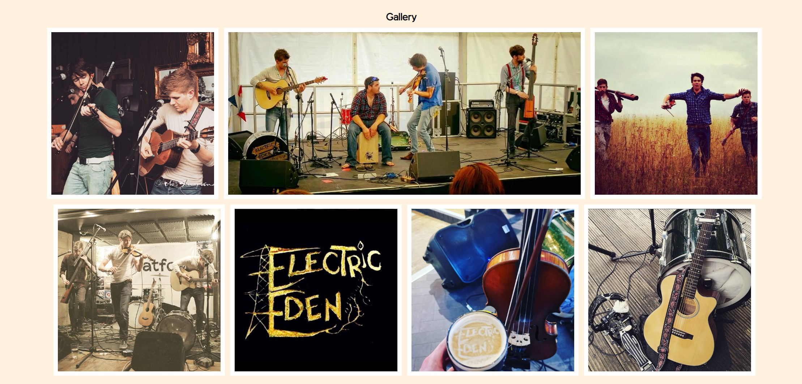
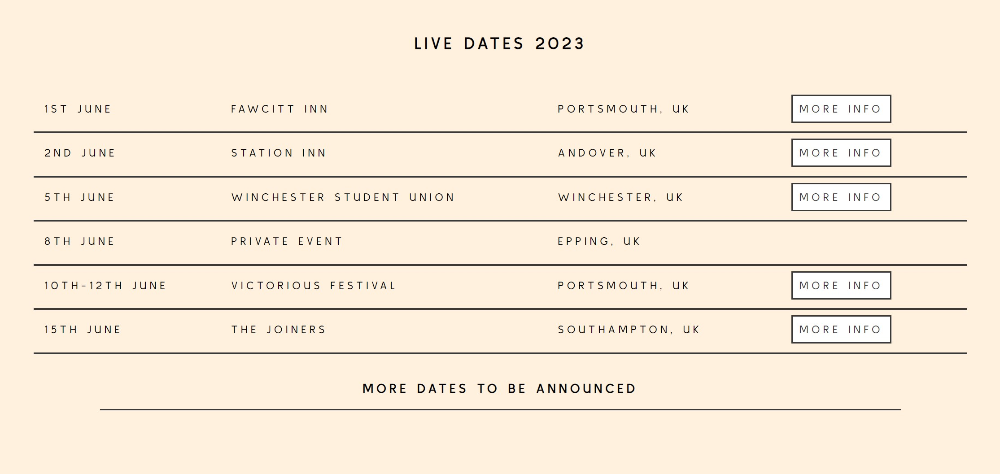
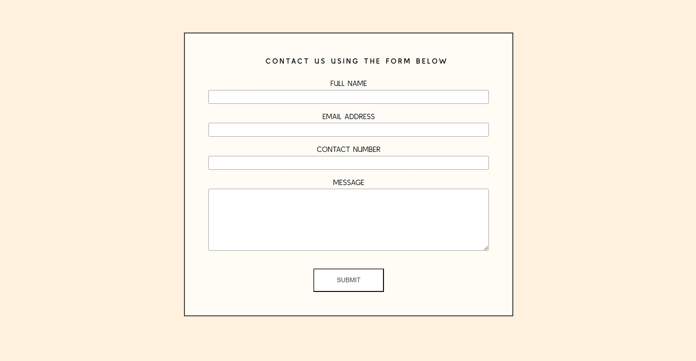
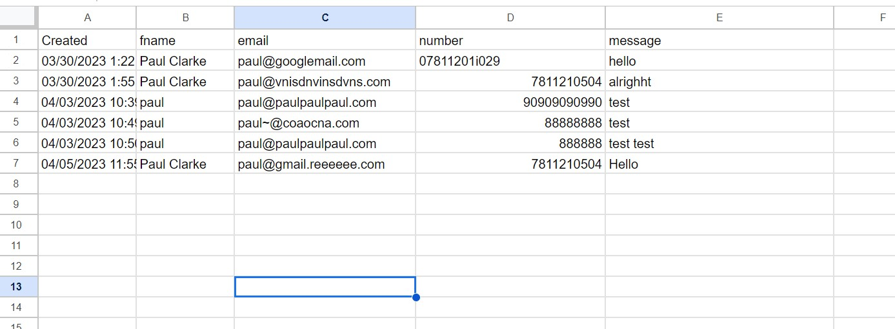

# Electric Eden
Electric Edens site is expressly dedicated to the fan base to help them find ways to download their latest music, find out the live dates and get in contact with any requests, queries and bookings. It'll target the people who already know who the band are and give them opportunity to find out more relevant information. 

## Features

__Navigation Bar__
 
- The navigation bar is fixed to the top each of the pages regardless if you scroll or not, giving the user quick, easy access to select the page they want. 
- On the left we have the navigational menu. When hovering over a particular page name, the text is shadowed to help the user see which page they are about to select. 
- On the right, we have the band logo that when selected will take you back to the home page. 
- The colours are partially matched to the imagery to give that consistent feel across the site. 

## Home Page

- The Home Page offers the user a simple but striking visual of contrast and depth. 
- The background is a blown-up view of the album artwork.
- The foreground shows the band name, links to the relevant music download sites and the full album cover nestled centrally in a white background. 

__Footer__
- The footer is fixed to the bottom of each page. 
- The user is greeted with friendly and recognisable logos to help direct them to the relevant social networks.
- Copyright of the page, images, videos are all help by Electric Eden. 
- The icons are brought more centrally to make it consistent with the feel of a central design.

## Media Page

__Video__

- You're first greeted with a large, page size 30 second loop of Electric Edens music video, a taster, to give the user motivation to select the link to watch the full video. 
- The link is nested in a slightly opaque white box with dark writing to contrast and make it easy to read. 
- The link takes you to the full youtube video.

__Gallery__

- When you scroll down, you'll find a small gallery. 
- All images are bordered with a white box which helps bring it out, giving a more immersive look to the images. 
- The gallery gives the user an insight to what the band does, the instruments used and the fun they have. 

## Live Dates

__Dates__

- This simple and user friendly visual gives the user access to see the dates the band are playing live.
- It has a 'more info' button for the user to use in case they want to find out more information on any particular event. 
- It shows the date, venue and location of each gig. 

## Contact

__Contact Form__

- This contact form gives the user a simple and effective way to contact the band.
- The full name, email and message all have required fields to ensure the user has completed the necessary inputs. 
- The form, once submitted is directed to a google sheet which can be easily filtered so the band can see who to contact. 

- The google sheet results like this;

## Contact Success

__Contact Success Page__

- This hidden page appears once the user has successfully completed the form and selected the submit button. 
- It offers the user a simple way to return back to the home page. 

