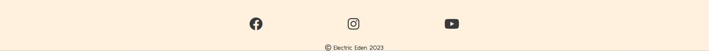

# Electric Eden #
Electric Edens site is expressly dedicated to the fan base to help them find ways to download their latest music, find out the live dates and get in contact with any requests, queries and bookings. It'll target the people who already know who the band is and give them an opportunity to find out more relevant information.

This is the best place to discover and immerse yourself in <a href = https://pjrclarke.github.io/electricedenPP1/index.html>Electric Eden</a>.

# Contents
* [**User Experience**](<#user-experience>)
    * [User Stories](<#user-stories>)
* [**Wireframes**](<#wireframes>)
* [**Site Structure**](#site-structure)
* [**Design Choices**](#design-choices)
    * [Typograghy](#typograghy)
    * [Colour Choices](#colour-choices)
* [**Features**](<#features>)
    * [**Home Page**](<#home-page>)
        * [Navigation Bar](<#navigation-bar>)
        * [Footer](<#footer>)
    * [**Media**](<#media-page>)
        * [Video](<#video>)
        * [Gallery](<#gallery>)
    * [**Live Dates**](<#live-dates>)
        * [Dates](<#dates>)
    * [**Contact**](<#contact>)
        * [Contact Form](<#contact-form>)
    * [**Contact Success**](<#contact-success>)
        * [Contact Success Page](<#contact-success-page>)
    * [**Future Features**](<#future-features>)
    * [**Technologies Used**](#technologies-used)
* [**Testing**](<#testing>)
    * [**Lighthouse**](<#lighthouse>)
        * [Lighthouse - Home Page](<#lighthouse---home-page>)
        * [Lighthouse - Media Page](<#lighthouse---media-page>)
        * [Lighthouse - Live Dates](<#lighthouse---live-dates>)
        * [Lighthouse - Contact](<#lighthouse---contact>)
    * [**Validator Testing**](<#validator-testing>)
        * [HTML - Validation](<#html>)
            * [index.hmtl](<#indexhtml>)
            * [media.html](<#mediahtml>)
            * [live.html](<#livehtml>)
            * [contact.html](<#contacthtml>)
        * [CSS - Validation](<#css>)
* [**Deployment**](<#deployment>)
    * [To deploy the project](<#to-deploy-the-project>)
    * [To fork the project](<#to-fork-the-project>)
    * [To clone the project](<#to-clone-the-project>)
* [**Credits**](<#credits>)
    * [Content](<#content>)
    * [Media](<#media>)
    * [Acknowledgments](<#acknowledgments>)

# User Experience #

## User Stories ##

- As a User I want to be able to navigate through the site smoothly.
- As a User I want to be able to contact Electric Eden with ease. 
- As a User I want to know how to download Electric Edens music. 
- As a User I want to be able to see where the band are playing next and find out more information about that gig. 
- As a User I want to be able to easily connect to Electric Edens social media platforms. 
- As a User I want to be able to see media on the band and where I can see more. 

[Back to top](<#content>)

# Wireframes #

The Wireframes for the Electric Eden website were made on [Balsamiq](https://www.balsamiq.cloud). The images below show the display on a full size browser as well as a smaller handheld device. There are slight differences on the real site due to what I considered to be a better user experience. 

The mobile screen offers a more vertical design, stacking elements and ensuring that the user experience isn't hindered by a screen width. 

[Back to top](<#content>)

# Site Structure #

Electric Eden has four pages. [Home](index.html), [Media](media.html), [Live Dates](live.html) and [Contact](contact.html). There is also a ['Hidden'](emailsuccess.html) Page that acts as an indication of succession upon completion of the contact form. These links are all within the navigation menu, in the header, on every page and gives clear indication on which page you're on by highlighting that particular page. 

# Design Choices #

## Typograghy ##

The choice of font was [Kulim Park](https://fonts.google.com/specimen/Kulim+Park) in regular 400. This is shown throughout the website. The Clean lines on the font and espeically in uppercase gives the sense of a clear cut and professional design choice. 

## Colour Choices ##

The colour palette of the website is fairly simplistic with three main colours showing. The font simply being a soft dark grey and the main colour, shown in the header, footer and any other open space being a soft beige colour to tie in with a colour selection ripped from the album image - This helps highlight the image further and with the contrasting typograghy colouring, it really helps it stick out. 

# Features

Elecrtric Edens website welcomes you with a grand image, showcasing their album artwork in a unique way and is the forefront of the attention. Throughout the website you're welcomed with calming colours and curiosity. 

## Home Page ##

- The Home Page offers the user a simple but striking visual of contrast and depth.
- The background is a blown-up view of the album artwork.
- The foreground shows the band name, links to the relevant music download sites and the full album cover nestled centrally in a white background.

[Back to top](<#content>)

## Navigation Bar ##
 
 
- The navigation bar is fixed to the top of each of the pages regardless if you scroll or not, giving the user quick, easy access to select the page they want.
- On the left we have the navigational menu. When hovering over a particular page name, the text is shadowed to help the user see which page they are about to select.
- On the right, we have the band logo that when selected will take you back to the home page.
- The colours are partially matched to the imagery to give that consistent feel across the site.

[Back to top](<#content>)

## Footer ##

- The footer is fixed to the bottom of each page.
- The user is greeted with friendly and recognisable logos to help direct them to the relevant social networks.
- Copyright of the page, images, videos are all held by Electric Eden.
- The icons are brought more centrally to make it consistent with the feel of a central design.

[Back to top](<#content>)

## Media Page ##

### Video ###

- You're first greeted with a large, page size 30 second loop of Electric Edens music video, a taster, to give the user motivation to select the link to watch the full video.
- The link is nested in a slightly opaque white box with dark writing to contrast and make it easy to read.
- The link takes you to the full youtube video.

[Back to top](<#content>)

### Gallery ###

- When you scroll down, you'll find a small gallery.
- All images are bordered with a white box which helps bring it out, giving a more immersive look to the images.
- The gallery gives the user an insight to what the band does, the instruments used and the fun they have.

[Back to top](<#content>)

## Live Dates ##

 ### Dates ###

- This simple and user-friendly visual gives the user access to see the dates the band are playing live.
- It has a 'more info' button for the user to use in case they want to find out more information on any particular event.
- It shows the date, venue and location of each gig.

[Back to top](<#content>)

## Contact

### Contact Form ###

- This contact form gives the user a simple and effective way to contact the band.
- The full name, email and message all have required fields to ensure the user has completed the necessary inputs.
- The form, once submitted is directed to a google sheet which can be easily filtered so the band can see who to contact.

- The google sheet results like this;

[Back to top](<#content>)

## Contact Success

### Contact Success Page ###

- This hidden page appears once the user has successfully completed the form and selected the submit button.
- It offers the user a simple way to return back to the home page.

[Back to top](<#content>)

## Future features

- As this is a band page, it would need to be regularly updated with new imagery, dates and links.
- Ideally I would like to add a merchandise store later down the road.

[Back to top](<#content>)

# Technologies used #

* [HTML5](https://en.wikipedia.org/wiki/HTML5) - Provides the content for the website.
* [CSS](https://www.w3schools.com/css/css_intro.asp) - Provides the styling. 
* [Balsamiq](https://balsamiq.cloud/) - Used to create the wireframes. 
* [CodeAnywhere](https://codeanywhere.com/) - Used to host and edit all code and the website. 
* [Gitpod](https://www.gitpod.io/#get-started) - Used to deploy the website

# Testing

## Lighthouse

- During lighthouse testing the results are as follows;

## Lighthouse - Home Page ##

- Performance marked down from 100. This is due to the img types. I know now that using .WebP would be a more efficient image source to use and can do this moving forward.
- 100% all other aspects.  

[Back to top](<#content>)

## Lighthouse - Media Page ##

- As expected from the homepage results, the performance has been hindered due to image file type. Something I will do in future is make sure the file type is the correct one.
- Accessibility is 100%.
- Best practice is for one image aspect ratio - Something I'll amend in future.

[Back to top](<#content>)

## Lighthouse - Live Dates ##

- Same issue above with the logo being a .png file.
- Interesting SEO considered 'More Info' to not be specific to what the user will be clicking - Which I disagree with.
- The user will clearly click on that link to find out more information about that particular event.

[Back to top](<#content>)

## Lighthouse - Contact ##

- Contact form is good across the board. Aside from the consistent performance issue with the images.

[Back to top](<#content>)

# Validator Testing #

## HTML ##
  - No errors or issues were returned when passing through the official [W3C validator](https://validator.w3.org/nu/?doc=https%3A%2F%2Fcode-institute-org.github.io%2Flove-running-2.0%2Findex.html)

### index.html ###

### media.html ###

### live.html ###

### contact.html ###

 
 ## CSS ##
  - No errors or issues were found when passing through the official [(Jigsaw) validator](https://jigsaw.w3.org/css-validator/validator?uri=https%3A%2F%2Fvalidator.w3.org%2Fnu%2F%3Fdoc%3Dhttps%253A%252F%252Fcode-institute-org.github.io%252Flove-running-2.0%252Findex.html&profile=css3svg&usermedium=all&warning=1&vextwarning=&lang=en#css)

[Back to top](<#content>)

# Deployment

## To deploy the project ##

The site was deployed to GitHub pages. The steps to deploy are as follows:

- In the GitHub repository, navigate to the Settings tab.
- Select pages on the left hand menu.
- Ensured "deploy from a branch" is selected.
- Ensure the branch is set to "main" and "/root".
- Click save.
- Allow a minute.
- Refresh and the deployed link can be found at the top of the page.

The live link can be found here - https://pjrclarke.github.io/electricedenPP1/index.html

## To fork the project ## 

A copy of the repository can be made by forking the github account. This is the safest way to view and make changes as it won't have any affect on the original repository. The steps to fork the repository as as follows;

- Log into Github and find the [repository](https://github.com/pjrclarke/electricedenPP1).
- On the right hand side of the screen, there is a button called 'Fork'. Select this to  for the repository onto this github account. 

## To clone the project ##

The method to clone this repository is as follows; 

- Under the repository name, click on the clone tab. 
- Once selected, click the copy to clipboard icon. 

- In the IDE chosen to clone the project to, open gitbash.
- Change the working directory to the location you want the cloned directory to be made. 
- Type "git clone" in the terminal and then paste the URL copied from github.
- Press Enter - The clone is now created. 

[Back to top](<#content>)

# Credits

## Content ##

- [Sheet Monkey](https://sheetmonkey.io/) is the third party URL used to help push the results from the form to a google sheet.
- The icons on the homepage and the footer on each page were taken from [Font Awesome](https://fontawesome.com/)
- The fonts were taken from [Google Fonts](https://fonts.google.com/)
- All code is custom by myself.
- Logo created by Amy Davidson and handed ownership to Electric Eden.
- The Wireframes were created using software on [Balsamiq](https://www.balsamiq.cloud).

[Back to top](<#content>)

## Media ##

- All imagery and videos are from Electric Eden. Some from Instagram [Electric Eden Instagram](https://www.instagram.com/electricedenband/?hl=en) and some are from their general website [Electric Eden](https://www.electriceden.co.uk). The rights to the images and videos belong to us.
- All images are owned by Electric Eden
- All videos are owned by Electric Eden

[Back to top](<#content>)

## Acknowledgments ##

The site was completed as a Portfolio 1 Project piece for the Full Stack Software Developer (e-Commerce) Diploma at the [Code Institute](https://codeinstitute.net/). As such I would like to thank my mentor [Precious Ijege](https://www.linkedin.com/in/precious-ijege-908a00168/), the Slack community, and all at the Code Institute for their help and support.

Paul Clarke - 2023. 

[Back to top](<#content>)

